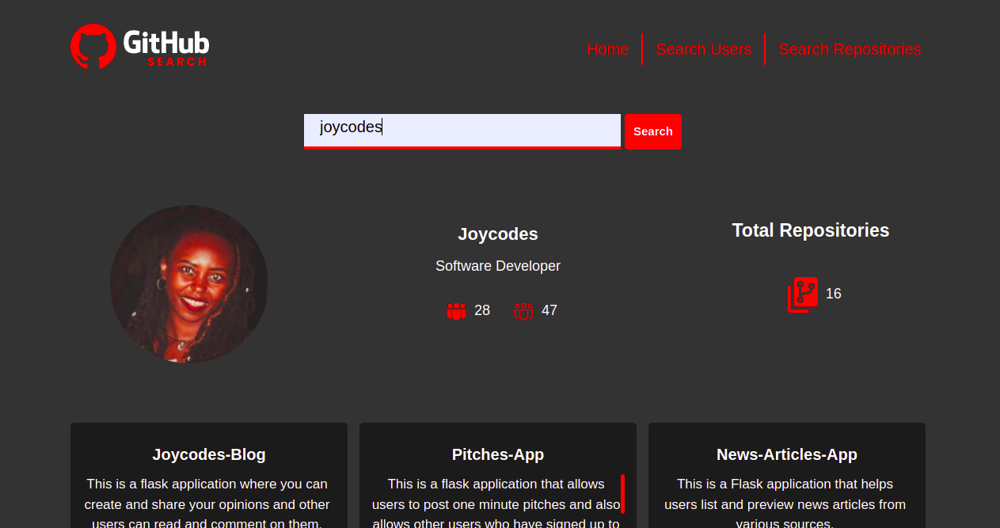

# GithubSearch

## Author

[Joyce Nguttu](https://github.com/joycodes)

## Description

Angular Web Github Search App that uses the Github API to generate Github users' details.
This project was generated with [Angular CLI](https://github.com/angular/angular-cli) version 13.3.1.

## Screenshot

## Development server

Run `ng serve` for a dev server. Navigate to `http://localhost:4200/`. The application will automatically reload if you change any of the source files.

## Code scaffolding

Run `ng generate component component-name` to generate a new component. You can also use `ng generate directive|pipe|service|class|guard|interface|enum|module`.

## Build

Run `ng build` to build the project. The build artifacts will be stored in the `dist/` directory.

## Running unit tests

Run `ng test` to execute the unit tests via [Karma](https://karma-runner.github.io).

## Running end-to-end tests

Run `ng e2e` to execute the end-to-end tests via a platform of your choice. To use this command, you need to first add a package that implements end-to-end testing capabilities.

## Technologies Used

* [HTML5](https://github.com/topics/html5)
* [CSS](https://github.com/topics/css3)
* [AngulerCLI]
* markdown
* [Bootstrap](https://github.com/topics/bootstrap)

## Live Link
[https://joycodes.github.io/github-search/]

## Contact Information 

If you have any question or contributions, please contact me on LinkedIn at [https://www.linkedin.com/in/jnguttu/]

## License
* *MIT License:*
* Copyright (c) 2022 **Joyce Nguttu**
